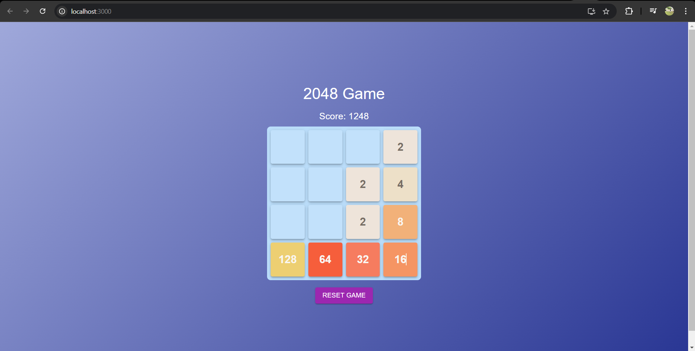

# React 2048 Game

This is a 2048 game built using React. The objective of the game is to combine tiles with the same value to reach the 2048 tile. You can use the arrow keys to move the tiles around the grid.

## Features

- Playable 2048 game with smooth animations.
- Responsive UI with Material-UI components.
- Keep track of the score.

